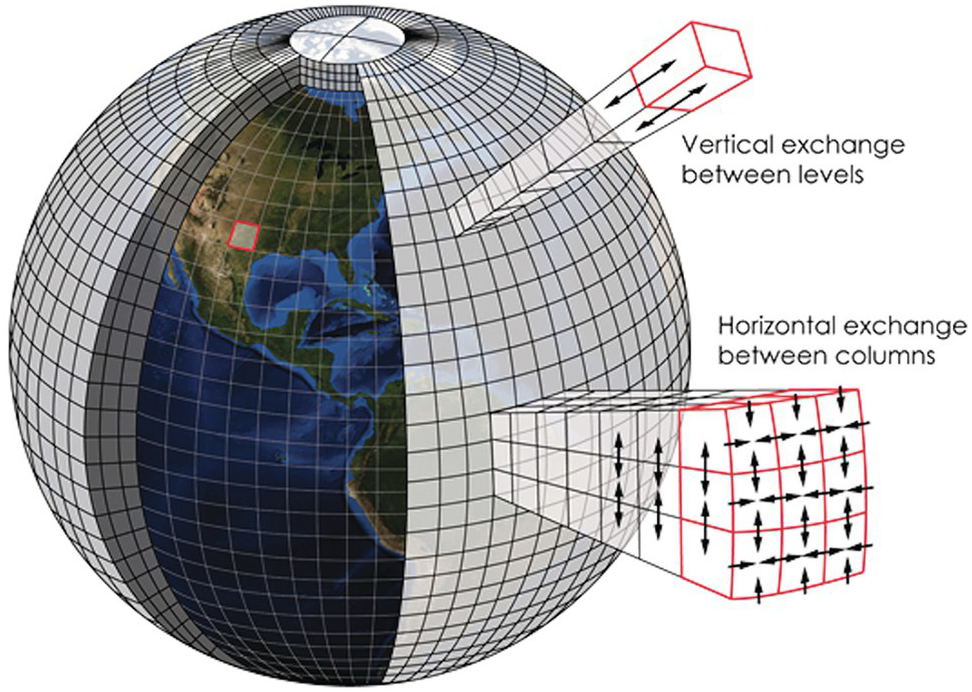
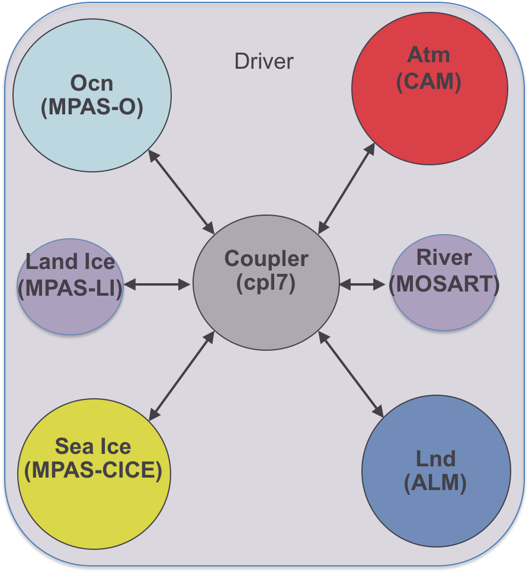

## 2.3 Climate Modeling

Since you will inevitably be working with the output from numerical climate models for your climate change impact study, it's important that you first gain some familiarity with what these models are, how they attempt to represent the climate system, and their key limitations. Before continuing, it's important to keep in mind that any model is indeed a *representation* of a system, it is not the system itself, and it is inherently flawed. The infamous quote from the statistician George Box says "All models are wrong, but some are useful".  Because of their deficiencies, we cannot take the output of climate models at face value. The purpose of using downscaling in a climate change impact analysis workflow is to minimize the "wrongness" and maximize the "usefulness" of climate change projections from climate models.

### 2.3.1 What is a Climate Model?

Moving beyond the philosophically true yet vague statement "a climate model is a representation of the climate system", a climate model *practically* is a computer program that solves a very large set of mathematical equations. These equations arise from basic physical laws like conservation of mass, energy, and momentum, applied to fluids (the atmosphere and oceans) and their interactions with other parts of the climate system such as the land surface and ice sheets. Because these equations have no closed-form solution, we solve them *numerically* on a computer by discretizing them in both space and time. In other words, the model divides the Earth into many boxes that make up a 3D grid, and solves the equations by turning derivatives into differences and integrals into sums. The time coordinate of the model is similarly divided into discrete time-steps by which the time evolution of the model's weather marches forward.

||
|:--:|
|*Schematic of a Discrete Climate Model Grid, from [Earth Magazine](https://www.earthmagazine.org/article/todays-weather-forecast-good-strong-chance-improvement/) and [Kotamarthi et al., 2021](https://doi-org.myaccess.library.utoronto.ca/10.1017/9781108601269)*|

The types of models discussed here are comprehensive, global-scale models that aim to represent as many aspects of the climate system. The earliest sorts of these models simulated only the atmosphere, and had the effects of the oceans *prescribed* using observed sea-surface temperatures as a lower boundary condition over grid cells where there is no land surface. They were mainly used for studying the large-scale atmospheric circulation (like jet streams and Hadley cells), as as such were called "General Circulation Models", or GCMs. Over time, these models have come to actively simulate more and more aspects of the climate system, including the ocean, land surface, cryosphere (ice sheets, sea ice, and permafrost), and even a complex representation of the carbon cycle that includes biological processes (biogeochemistry). A sixth component called the "coupler" is responsible for transferring the relevant information from each component to the others, ensuring the entire simulated climate system is self-consistent. A model that includes all of these components (and critically, an actively simulated carbon cycle) is called an "Earth System Model" (ESM), and the acronym GCM is now often taken to stand for "Global Climate Model", with the modern understanding of GCM being a model that falls anywhere between a classical atmosphere-only model and a full-fledged ESM. With apologies, this loose definition of GCM will be used in this guidebook, though the precise definition of ESM will be used only when appropriate.

||
|:--:|
|*Schematic of the coupler for the E3SM Earth System Model, from the [E3SM v1 Description](https://e3sm.org/model/e3sm-model-description/v1-description/)*|

### 2.3.2 Model Resolution

The size of the grid boxes the model uses for discretization is a crucial part of the model design, and provides a massive constraint on which physical processes it can represent directly and accurately. Since the earth's horiontal spatial scale (i.e. the circumference of the planet, about 40,000 km) is much magnitude greater than the height of the top of the stratosphere (about 50 km), and because the way models discretize the vertical levels is different from how they discretize their horizontal grid, we will focus on the **horizontal** spatial resolution of models.

The climate system involves interactions between physical processes that act at very large scales, like the overturning circulation of the atmosphere and oceans, and very small scales, like dissipation of energy through molecular viscosity, and those in between, like thunderstorm cells and wind gusts. Because the atmosphere is so big, we obviously cannot hope to directly simulate molecular viscosity, but we'd like to be able to directly simulate important weather phenomena like tropical cyclones (hurricanes). The limiting factor regarding model resolution is computing power. With more grid cells (or more vertical levels), we need to solve more equations and keep track of a greater number of variables, which requires more processors and more memory. Because of a mathematical result called the [Courant-Friedrichs-Lewy condition](https://en.wikipedia.org/wiki/Courant%E2%80%93Friedrichs%E2%80%93Lewy_condition), finer spatial resolution also requires a smaller time step, further increasing the number of calculations to be performed. 

Coarser spatial resolution means poorer representation of many important parts of the climate system, and more processes that need to be *parameterized* (see below). Higher resolution may yield better results, but in order to do the many hundreds of years of simulation that scientists are interested in, the amount of computer power (and time) needed is too high. The proverbial "sweet spot" for the most recent generation of GCMs is a spatial resolution of about 100 km $\times$ 100 km, or in terms of latitude and longitude, about $1^{\circ} \times 1^{\circ}$.  As computer hardware and numerical methods improve, typical model resolution tends to increase over time, but we are still a long way away from efficient global simulation at the types of spatial scales typically needed for local climate impact studies. Insufficient model resolution is a huge reason why we need to include downscaling in climate change impact analysis.

### 2.3.3 Parameterizations
Processes too small to be directly simulated at the model resolution are represented indirectly through **parameterizations**, sometimes called the model *physics* (as opposed to *dynamics*, which are directly simulated at the grid scale). Such small-scale processes are referred to as sub-grid scale. The fundamental physics (in the traditional sense) behind parameterizations is typically less well understood than the physics used to construct the set of dynamical equations. Parameterizations are sometimes developed from empirical data rather than fundamental phsyical theory. Basically every climate model solves the same set of dynamical equations, just possibly with different choices regarding the numerical scheme. The major differences between models will lie in the physics parameterizations, and these differences in construction can result in substantial differences in model output. One important aspect of the atmosphere that is parameterized in global models is clouds. Through [cloud feedbacks](https://pcmdi.llnl.gov/projects/cloud_feedbacks/), changes to cloudiness and different types of clouds may either amplify or attenuate global warming, so uncertainties in model representation of clouds is directly related to uncertainty in the amount of global warming produced by a given amount of greenhouse gas emissions. Recall that in the climate system, small-scale processes interact with large-scale processes, so uncertainties in parameterizations can and do result in uncertanties in both large and small-scale climate projections. This is one reason why finer spatial resolution is thought to improve the accuracy of climate models - reduced need for uncertain parameterizations.

### 2.3.4 Model Intercomparison Projects

In this section there has been repeated mention of "climate models" generically, so clearly many such models exist and are used for studying the climate. Academic and governmental research institutions in many countries around the world develop, run, and publish their own models, and the output is shared and compared through so-called "MIPs" or **Model Intercomparison Projects**. The most well-known MIP is the **Coupled Model Intercomparison Project** (CMIP), most recently its 6th phase ([CMIP6](https://wcrp-cmip.org/cmip-phase-6-cmip6/)). The CMIP project is about overall comparison between the large-scale climate of different models, using common external forcing boundary conditions for both historical and plausible future scenarios. Output from simulations contributing to CMIP5 and CMIP6 has been made available to the public for further analysis and scientific use through the Earth System Grid Federation ([ESGF](https://esgf-node.llnl.gov/projects/esgf-llnl/)), which is an enourmous achievement of international scientific collaboration. The entire CMIP6 archive includes hundreds of simulations from dozens of models, and totals to over 14 petabytes of data! We will make use of some of this data in the following chapters of this guidebook. 

Additional, more specific MIPs exist for studying how particular aspects of the climate system are represented by different models, and require simulations with boundary conditions that may not reflect plausible climate scenarios (i.e. [PAMIP](https://www.wcrp-climate.org/modelling-wgcm-mip-catalogue/cmip6-endorsed-mips-article/1303-modelling-cmip6-pamip.), [RAMIP](https://doi.org/10.5194/gmd-2022-249)). These MIPs are mostly for academic purposes rather than for producing projections relevant for stakeholders, but the scientific knowledge they generate are critical for further development of such practical simulations by improving the models.
