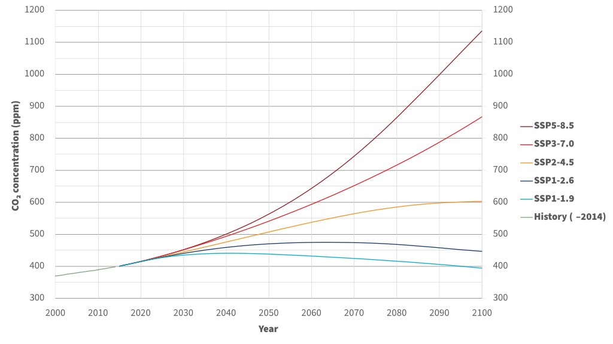

## 2.4 Climate Model Uncertainty

From the discussion in the previous section, you likely picked up on the fact that projections made using climate models are inherently subject to uncertainty. In fact, each of the three main sources of uncertainty in climate modeling were strongly hinted at in Sections 2.1 and 2.2, but here they will be laid out explicitly, and we will discuss how climate scientists attempt to quantify the effects of each source of uncertainty.

### 2.4.1 Scenario Uncertainty

The most obvious source of uncertainty in future climate projections is that we don't what actions humans will take that affect the climate. We don't know how much much CO$_{2}$ and other greenhouse gases we will emit, we don't know how land use will change, and we don't know what sorts of policies will be adopted and implemented to mitigate climate change. In other words, there is no "correct" set of boundary conditions to give to a climate model to do projections of future climate. Instead, we can study a range of plausible future pathways of emissions and other anthropogenic factors that influence the climate, and take a conditional approach. *If* humans follow this certain course of action, *then* this is what the effects on the climate could be. As a part of the CMIP protocols and the IPCC Assessment Reports, experts develop a set of scenarios reflecting different courses of action, from aggressive mitigation and carbon removal to laissez-faire regulation and continued heavy reliance on fossil fuels. These scenarios include time series of greenhouse gas concentrations, land usages, and other human-influenced boundary conditions to use for future climate simulation. 

||
|:--:|
|*Atmospheric CO2 concentrations for each SSP scenario, from [Wikipedia](https://en.wikipedia.org/wiki/Shared_Socioeconomic_Pathways)*|

For CMIP5/AR5 (circa 2013-2014), these scenarios were called the [Representative Concentration Pathways](https://skepticalscience.com/rcp.php), or "RCPs", each numbered by the year-2100 net top of atmosphere [radiative forcing](https://en.wikipedia.org/wiki/Radiative_forcing) in units of $W/m^{2}$ (i.e. RCP2.6, RCP4.5, and RCP8.5). For the next phases of each of these projects (CMIP6 and AR6), these scenarios were expanded upon with the [Shared Socioeconomic Pathways](https://www.carbonbrief.org/explainer-how-shared-socioeconomic-pathways-explore-future-climate-change/) (SSPs), which include additional GHG scenarios as well as new factors such as population growth and economic factors so that social scientists can use the same analysis framework as physical climate scientists.

The existence of these different scenarios is great, but it doesn't resolve the issue that we don't (and can't) know which one will be closest to reality. No likelihood of any of the SSPs or RCPs is quantified. That leaves you as someone studying the impacts of climate change with a choice. You can either look at an envelope of possible outcomes by choosing a high and low forcing scenario, be conservative and focus only on the worst-case, highest forcing scenario, or you can sidestep the issue entirely, and instead look at impacts at a particular level of global warming (i.e. 2$^{\circ}$C), using data from several different scenario-simulations together. The idea behind this latter approach is that the impacts of a certain amount of global warming should be similar regardless of how long it took to get there, and the main difference between scenarios is how long it takes to reach a certain warming level. Nothing guarantees this to be true, which is why it's important to use data from multiple scenarios to construct the projections. Note that for some applications, such as the likelilood of record-breaking extreme events, the rate of warming *can* be relevant for the results ([Fischer et al., 2021](https://doi.org/10.1038/s41558-021-01092-9)), so take this into account when deciding which approach to take regarding scenario uncertainty.

### 2.4.2 Internal Variability

Section 2.1.2 introduced you to the concept of natural climate variability, and broke it down into two components. Natural external forcings, such as variations in the intensity of incoming solar radiation, and internal variability, due to the inherent chaos in the climate system and modes of variability such as the El-Nino Southern Oscillation. For a given, fixed external forcing (be it natural or anthropogenic), there exist many possible time evolution trajectories for the system to take. Some possible realizations may have more El-Ninos (for example), which would make them warmer than those that have more La Ninas. Looking at only one projection of the future, we can't separate the effects of the external anthropogenic forcing from the effects of internal variability. The amount of projected global warming (or any change to any quantity) could be inflated or deflated by the effects of internal variability. The only way to study the effects of internal variability is to run an **ensemble** of simulations, to sample the range of possible trajectories for a given pathway of external forcing. The spread across the ensemble (standard deviation, IQR, etc.) is how we quantify the uncertainty due to internal variability.

The particular trajectory for a given climate model simulation with fixed external forcing depends on the initial conditions. You may wonder why we can't just initialize a model with observed intitial conditions, to see what future the model projects for the trajectory of our real-world climate system. Doing this would essentially be an attempt to forecast the weather years or decades into the future - it's impossible! We don't have spatially complete and infinitely precise observations of the climate system, so after a very short period of time, the model trajectory would become completely detached from our real-world realization of internal variability. Instead, we estimate the size of the fluctuations due to internal variability by running many different simulations with the same external forcing, but slightly different initial conditions. Each individual simulation is called an **ensemble member**. Each ensemble member represents an equally plausible trajectory of the climate given the external forcing - even historical forcing. Climate modelers run ensembles for historical (20th century) and pre-industrial control levels of GHGs and other boundary conditions, to establish the effects of internal variability on the baseline climate from which anthropogenically forced changes are assessed. Ensembles of future forcing scenarios (the RCPs or SSPs) are used to disentangle true climate change signals from fluctuations due to internal variability. The best estimate of a model's projected climate can be taken to be the **ensemble mean**, or average of results across all members of the ensemble.

### 2.4.3 Model Structural Uncertainty

The third major source of uncertainty relates to the different choices in model construction. Differences in the model numerical schemes and in parameterizations mean different models give different answers, and only to a limited extend can we say that one model may be more reliable than another. By comparing model output for a historical simulation to observations, we can quantify the model **bias**, and one might be tempted to place more confidence in the projecions of the model that is the least biased (in other words, the one that best reproduces the observed historical climate). However, there is an issue with climate modeling (and other sorts of modeling of complex systems) called *[equifinality](https://en.wikipedia.org/wiki/Equifinality)*. Equifinality in this context means that multiple different models can agree equally well with historical observations, but they can each produce different future projections. The model with the lowest bias for the past is not guaranteed to have the best performance in the future. We really have no way to pick a single model to expect to perform best.

Structural uncertainty can be quantified by including a **multi-model ensemble** in your analysis. The IPCC Assessment Reports frequently use multi-model averages as our best estimates of future climate, though such averaging must be done carefully. Generally the best practice is to perform analysis for each model individually, and aggregate the final results to produce a range of final results that encompass the distribution across models, and thus reflect inter-model uncertainty. Averaging before computing derived quantities can attenuate internal variability and extreme events within individual model simulations, since the sequencing of events in one simulation is completely unrelated to the sequencing of events in another (this also holds true for aggregating data from different ensemble members from a single model). Since different models can produce different projections, but for reasons not well understood, it's necessary to include multiple models in your climate change impact study to properly quantify the degree of uncertainty in your projections. 