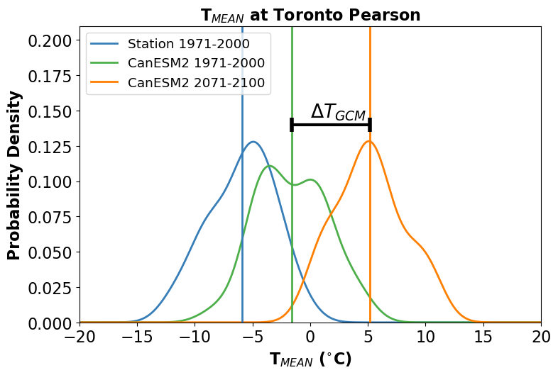
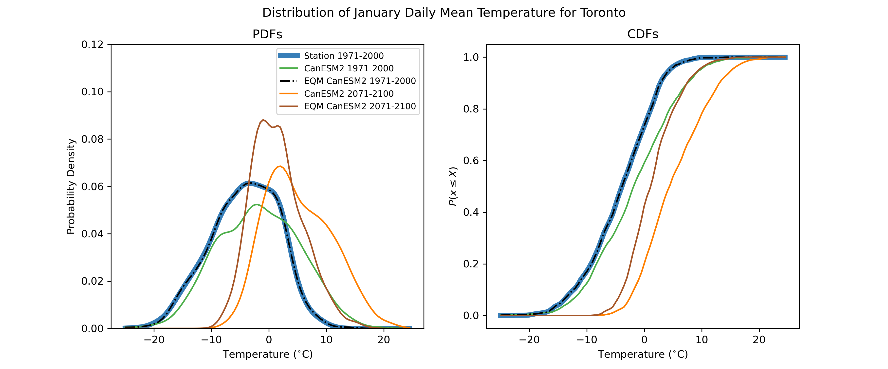

## 4.1 Bias-Correction Methods

A plethora of methods exist for statistical downscaling and bias correction - too many to document in this guide. Here we will cover several methods of varying degrees of complexity, most of which are implemented in the Python package `xclim`. The first few methods will be purely methods of univariate *bias correction*, and can be applied either to model ouput at a single location, using station observations as the training data, or as the bias-correction step in a true "downscaling" method, which produces gridded data with enhanced spatial resolution (using gridded observations as the training data). 

### 4.1.1 The "Delta" Method

The simplest possible method of bias correction is called the "Delta" method. In this method, the climate model ouput is used only to calculate the mean change in the quantity of interest $X$:

$$\Delta = X_{GCM}^{proj} - X_{GCM}^{hist}$$

For a ratio variable like precipitation (which is bounded below by zero), one would instead use a multiaplicative delta, i.e. $\Delta = X_{GCM}^{proj} / X_{GCM}^{hist} $ This delta is then added to (or multiplied with) the time series of observations to produce the bias-corrected future projections. i.e.

$$X_{SDS} = X_{OBS} + \Delta$$

This process is illustrated in the figure below. Each curve is the distribution of January monthly-mean temperature from a different data product - observations in blue, a historical simulation in green, and an RCP8.5 future projection in orange. The mean change $\Delta T_{GCM}$ is indicated with a black bar.

In the next figure, the bias-corrected (or "downscaled") distribution is shown in brown. Note that by construction, he difference between the mean of this distribution, and the mean of the observed distribution is also equal to $\Delta T_{GCM}$.

The time series of the bias-corrected output is shown in the third figure. Notice how the month-to-month fluctuations in the bias-adjusted (brown) curve match those for the station data exactly. This is again by construction, since this time series was produced by simply adding a constant to the station data.

We include this method for pedagogical purposes only - it is far too simple to be used in a modern climate impact study. However, understanding the limitations of this method is important for understanding the advantages of more sophisticated methods. This method only accounts for chnages in the mean of the quantity of interest, so applying it inherently assumes that the only relevant changes for your problem are changes in the mean. Under the Delta method, the shape of the projected downscaled distribution is the same as the shape of the observed distribution. This is quite often a poor assumption. For many applications, changes to variance and other higher-order moments are important, because they can result in changes to extremes. For this toy example of monthly mean temperatures, changes in extremes may not be so relevant, so the delta method might be fine. But for real-world applications with daily or sub-daily data, changes to extremes can sometimes be the most impactful consequence of climate change, and have to be accounted for in your study. 

This method also neglects all of the temporal variations in the simulated data, which is not always dersirable. For example, one might want a set of downscaled future data for a period of time longer than the observation record. Additionally, your application may require sub-daily data, but perhaps only daily observations are available for the target variable. For these situations, one could correct the mean bias of the model, i.e.

$$X_{SDS} = X_{GCM}^{proj} - \overline{X_{GCM}^{hist}} + \overline{X_{OBS}}$$

This is essentially equivalent to the Delta method, since the mean difference between $X_{SDS}$ and $X_{obs}$ will still be equal to $\Delta$. However, now the distribution of $X_{SDS}$ will have the same shape as $X_{GCM}^{proj}$ - which may be biased. The next method accounts for bias in the variance of the simulated data.

### 4.1.2 Bias-Variance Correction

The second simplest method of bias correction involves correction of both the mean bias and the variance of the climate model output. The deviations from the modelled historical mean are scaled to have a variance equal to the sample variance of the observations, and then these scaled anomalies are added to the observed sample mean. The transfer function for this method is:

$$X_{SDS} = \left(X_{GCM}^{proj} - \overline{X_{GCM}^{hist}} \right) \times \frac{\sigma_{OBS}}{\sigma_{GCM}^{hist}} + \overline{X_{OBS}}$$

This method expands on the Delta method by accounting for potential model biases in the variance of $X$, and retains the temporal fluctuations of the model output data. If the distribution of $X$ is Gaussian, this method is equivalent to **empirical quantile mapping**, which will be an important part of the more sophisticated methods to be discussed later. For highly non-Gaussian variables, such as precipitation or wind speed, this method would be inappropriate. These variables are bounded below by zero, and this method could result in unphysical negative values. For variables which are approximately Gaussian, like temperature (for a given month of the year), this method may be more appropriate, as illustrated in the figure below.

If mean temperatures are the most relevant metric for your study, this method of bias correction is likely sufficient. If extremes are important for your application, this method is not appropriate because the tails of an approximately-Gaussian distribution are where it may be most likely to have non-Gaussian behavior. For this reason, non-parametric quantile mapping methods are preferred, as they can handle data generated from any probability distribution.

### 4.1.3 Quantile Mapping Methods
**Empirical Quantile Mapping** 
As discussed, empirical quantile mapping can be used to map data sampled from one probability distribution to another. Empirical quantile mapping takes the $k$'th quantile of the input (climate model) distribution and maps it to the $k$'th quantile of the target (observed) distribution. For a random variable $X$, the $k$'th quantile is given by the inverse CDF evaluated at $k$, i.e. 

$$x_{k} = F_{X}^{-1}(k)$$

or equivalently,

$$k = F_{X}(x_{k})$$

Using these two equations, we derive the transfer function for empirical quantile mapping:

$$x_{SDS} = F_{OBS}^{-1}(F_{GCM}(x_{GCM}))$$

The process is illustrated in the figure below. By design, the distribution of the adjusted model historical data matches the observed distribution exactly.

On its own, empirical quantile mapping is not so useful for adjusting climate change projections, because the projected changes will be washed out by mapping the data back to the observed historical distribution. This can be seen in the massively deflated variance of the adjusted end-of-century projections, relative to the unadjusted raw model projections. Clever individuals have developed two variants of quantile mapping, which preserve projected changes while also correcting for biases in all quantiles of the target variable's distribution.

**Detrended Quantile Mapping**