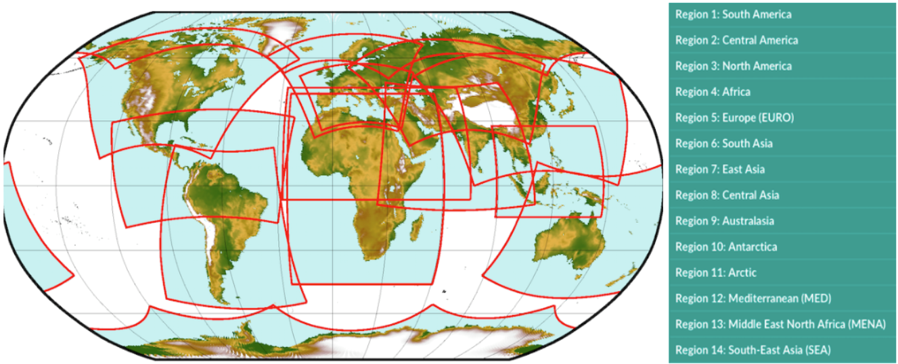

# 4.1 Downscaling Basics

## 4.1.1 Statistical Downscaling
Downscaling methods can be broken down into two categories: statistical and dynamical. In this guide, we will focus primarily on *statistical downscaling*. Statistical downscaling leverages robust empirical relationships between observational and climate model data to adjust model biases and refine the spatial resolution. The general statistical downscaling method can be expressed through the equation:

$$Y_{SDS} = f(X_{GCM} ; \theta(X_{GCM}^{hist}, Y_{OBS}))$$

where $Y$ is the climate variable of interest and $X_{GCM}$ is the (possibly vector-valued) "predictor" variable from the climate model output. The subscripts "OBS" and "SDS" mean "observed" and "statistically downscaled" respectively. The form of the transfer function $f$ is dictated by the particular method of statistical downscaling chosen. For the case of "point downscaling", where model output for a single location is bias-corrected using observations at a single location, we can usually write down a closed-form expression for the transfer function. For methods that perform true "downscaling" (i.e. enhance the spatial resolution, in addition to bias-adjustment), one should think of the transfer function more in the sense of a function in computer programming than mathematics. The downscaling procedure will be a multi-stage process, though each step involves mathematical operations. The following sections of this chapter will discuss several common methods of statistical downscaling, and provide some guidance on when to use which one.

The transfer function will generally have free parameters $\theta$ that we must estimate using observational data and model output. Since we cannot have observations of the future, we use only model data from a historical/control simulation ($X_{GCM}^{hist}$) for this "training" (or "fitting") step of statistical downscaling. After the training step, output from simulations of historical *or* future climate can be used as inputs to produce statistically downscaled estimates of $Y$. When producing downscaled estimates for projections of future climate, we must assume that the same statistical relationships from the historical period still apply. In other words, we assume that the statistical relationships between the simulated and observed climate are **stationary** - unchanging with time or different radiative forcing. This assumption is inherent to all methods of statistical downscaling. Again, since there are no observations of the future, we have no choice (under the framework of statistical downscaling) but to use historical relationships to adjust future projections. The assumption of stationarity is an important caveat to consider when interpreting the results of a study that uses statistically downscaled climate change projections.

||
|:--:|
|*Illustration of the Constructed Analogues statistical downscaling method, from [Abatzoglou (2011)](https://climate.northwestknowledge.net/MACA/MACAmethod.php) and {cite:t}`abatzoglou_comparison_2012`*|

## 4.1.2 Dynamical Downscaling

||
|:--:|
|*Standard domains for Regional Climate Model simulations contributing to the Coordinated Regional Downscaling Experiment (CORDEX) project {cite:p}`cordex-sat_summary_2020`.*|

Dynamical Downscaling involves using the output of a coarse resolution global model as boundary conditions for a limited-area, higher-resolution **Regional Climate Model** (RCM). Dynamical downscaling uses physical relationships to simulate the climate at a higher resolution, and because physics does not change over time, there is no reliance on the assumption of stationarity. RCMs will use higher-resolution lower boundary conditions (LBCs), and thus can directly simulate the effects of topography, land surface types, and bodies of water too small to be represented in the LBCs of GCMs. Because they don't use observations for bias-correction, they can also provide high-resolution climate information in regions where observations are sparse or unavailable, such as the Arctic or much of the Southern Hemisphere.

However, there are several drawbacks to dynamical downscaling as well. Because RCMs are numerical models run at high resolution, the computational cost is prohibitively high for those who don't have access to significant High-Performance Computing resources. The core-hours required are often higher than running a global model at standard resolution (though of course less than global high-resolution simulation). Next, unless you are able to run an RCM at extremely high (3 km or less) resolution, it's very likely that some amount of model bias will remain in the output, especially for variables like wind speed. This is the case for many of the RCMs used in the [CORDEX](https://cordex.org/) project, available for download from the ESGF (see Chapter 3.4). Thus it is common practice to do statistical downscaling on the output of RCMs, and it is a good idea to use CORDEX model output as a part of a multi-model statistical downscaling study. Because we don't expect users to have the computational resources or the expertise to run their own RCM simulations, we will not include further discussion on dynamical downscaling.