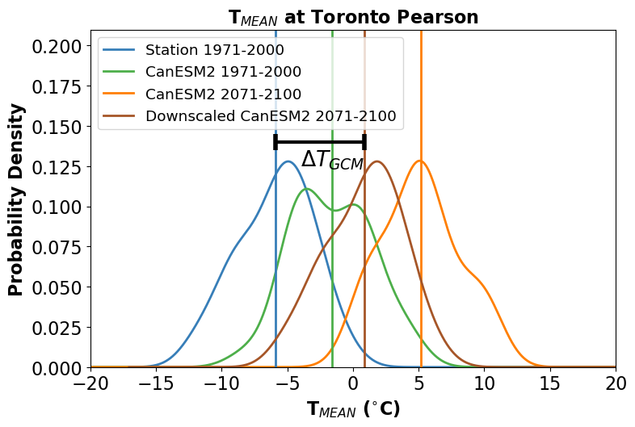

## 4.1 Downscaling Methods

A plethora of methods exist for statistical downscaling and bias correction - too many to document in this guide. Here we will cover several methods of varying degrees of complexity, most of which are implemented in the Python package `xclim`. The first few methods will be purely methods of univariate *bias correction*, and can be applied either to model ouput at a single location, using station observations as the training data, or as the bias-correction step in a true "downscaling" method, which produces gridded data with enhanced spatial resolution (using gridded observations as the training data).

### The "Delta" Method

The simplest possible method of bias correction is called the "Delta" method. In this method, the climate model ouput is used only to calculate the mean change in the quantity of interest $X$:

$$\Delta = X_{GCM}^{proj} - X_{GCM}^{hist}$$. 

This delta is then added to the time series of observations to produce the bias-corrected future projections. i.e.

$$X_{SDS} = X_{OBS} + \Delta$$

This process is illustrated in the figure below. Each curve is the distribution of January monthly-mean temperature from a different data product - observations in blue, a historical simulation in green, and an RCP8.5 future projection in orange. The mean change $\Delta T_{GCM}$ is indicated with a black bar.

In the next figure, the bias-corrected (or "downscaled") distribution is shown in brown. Note that tby construction, he difference between the mean of this distribution, and the mean of the observed distribution is also equal to $\Delta T_{GCM}$.

The time series of the bias-corrected output is shown in the third figure. Notice how the month-to-month fluctuations in the bias-adjusted (red) curve match those for the station data exactly. This is again by construction, since this time series was produced by simply adding a constant to the station data.

We include this method for pedagogical purposes only - it is far too simple to be used in a modern climate impact study. However, understanding the limitations of this method is important for understanding the advantages of more sophisticated methods.