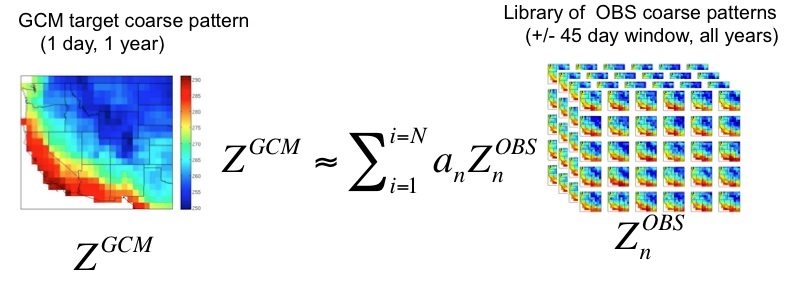
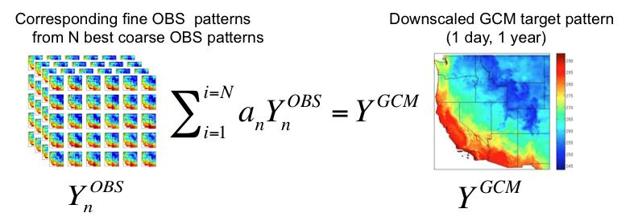
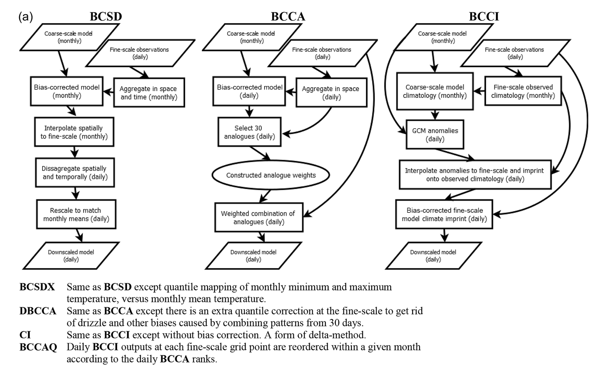

# 4.3 Downscaling Methods

In principle, each of the bias-correction methods described in Section 4.1 could be used to downscale climate model output to a finer resolution grid using gridded observations. One would simply need to re-grid (interpolate) the model output to the (finer) resolution of the gridded observations, and apply (for example) Quantile Delta Mapping to each grid cell independently. Doing this is problematic, because it can result in distortion of spatial covariance structures (i.e. {cite}`maraun_bias_2013,hnilica_multisite_2017`). For this reason, other methods for gridded statistical downscaling have been developed to correct biases at multiple sites/grid cells and preserve these covariance structures.

## 4.3.1 Bias Correction and Spatial Disaggregation

Also referred to as Bias Correction and Spatial Downscaling, BCSD {cite}`wood_hydrologic_2004` uses monthly output combined with daily high-resolution gridded observations to produce gridded statistical downscaling output. First, the daily gridded observations are coarsened to the model grid and aggregated to monthly means (monthly totals for precipitation). These coarsened/aggregated observed monthly means are used to bias-correct the GCM output using Empirical Quantile Mapping. These bias-corrected monthly means are then interpolated to the high-resolution grid of the observations. Finally, daily downscaled output is produced by the following procedure: For each GCM month, an observed month is selected at random, and the daily values for this observed month are adjusted attitively (multiaplicatively for precipitation) to match the downscaled monthly mean (total). Because of it has been around for so long, BCSD has been widely implemented, but has significant limitations. First, because it uses monthly mean GCM data as inputs, the downscaled results cannot reflect changes at sub-monthly timescales, such as changes to extreme weather. Here we describe BCSD only for pedagogical purposes - its use is not reccomended in the UTCDW.

## 4.3.2 Climate Imprints

The Climate Imprint (CI) method is a sort of delta method applied to gridded data. A GCM monthly climatology is constructed from a historical reference simulation, and this climatology is subtracted to produce daily GCM anomaly patterns. These GCM anomalies are interpolated to the fine-resolution grid of the observations, and added to the observed historical monthly climatology. A more advanced version of CI called BCCI (Bias Corrected CI) is described in {cite}`werner_hydrologic_2016`, where a quantile mapping bias correction is applied to the CI outputs. Neither CI or BCCI are methods reccommended by the UTCDW, but CI is a key step in the BCCAQv2 method used by PCIC to produce their [statistically downscaled climate scenarios for Canada](https://www.pacificclimate.org/data/statistically-downscaled-climate-scenarios) (described in the following subsection).

## 4.3.3 Analogue Methods
### 4.3.3.1 Constructed Analogues

Constructed Analogue (CA) based methods produce downscaled data by aggregating observed data from real days which best match a particular simulated day. As described in {cite}`werner_hydrologic_2016`, high-resolution observations are coarsened to the model grid, and $N$ (typically $N$ = 30) days with most similar to the given simulated day are selected. Typically anomaly fields (i.e. with the daily or monthly climatology subtracted) are used for each data product, instead of the total fields, to avoid the mean bias of the model influencing the selection of analogue days. The original authors ({cite}`hidalgo_downscaling_2008`) measure similarity using RMSE, but other similarity metrics are also supported in `xclim`. When searching for candidate observed patterns, only those within $\pm$ 45 days of of the day to be downscaled are included (i.e. for a simlated April 15th, only observed days from March 1st and May 30th are included, across all years in the observational dataset, for a pool of 90 $\times N_{YRS,OBS}$ candidate observed analogue days for each simulated day).

||
|:--:|
|*Illustration of observed pattern selection, from [Abatzoglou (2011)](https://climate.northwestknowledge.net/MACA/MACAmethod.php)* {cite}`abatzoglou_comparison_2012`|

The optimal linear combination of these $N$ observed anomaly patterns to reproduce the simulated anomaly pattern is determined using [ridge regression](https://en.wikipedia.org/wiki/Ridge_regression), and finally the downscaled anomalies are produced using the same linear combination on the high-resolution observed anomaly patterns {cite}`maurer_utility_2010`. The literature is unclear regarding best practices for reimposing the climatology onto the downscaled anomalies in the setting of future climate projections, since it mainly focuses on evaluating the skill of this method for the historical period. Regardless, use of stand-alone CA is not reccomended for downscaling future climate projections, so this ambiguity is not consequential for the UTCDW.

||
|:--:|
|*Illustration of analogue construction, from [Abatzoglou (2011)](https://climate.northwestknowledge.net/MACA/MACAmethod.php)* {cite}`abatzoglou_comparison_2012`|

### 4.3.3.2 Bias-Corrected Constructed Analogues

{cite}`maurer_utility_2010` proposed an adapted version of CA which corrects biases in the coarse-resolution GCM output using quantile mapping, before selecting the observed analogues. Total fields are compared to observations in the CA step, instead of anomalies, because biases relative to the observed climatology have already been adjusted. When using BCCA for downscaling future projections, Detrended Quantile Mapping is used for bias-correction, with separate trends estimated for each month of the year {cite}`hiebert_climdown_2018`.

{cite}`werner_hydrologic_2016` expand on BCCA with two additional analogue-based methods. Double BCCA (DBCCA) applies a second quantile mapping bias correction after the CA step, to adjust any biases introduced by combining observed days using a linear combination. For example, combining precipitation patterns from multiple days can reuslt in persistent small but finite amounts of precipitation, similar to the "drizzle" bias in GCMs where the frequency of days with zero precipitation is severely underestimated. DBCCA has also been referred to as BCCAP, or "Bias Corrected Constructed Analogues with Postprocessing" {cite}`murdock_statistical_2014`. 

Because of its strength at representing both spatial patterns and location-wise distributions, and its ease of implementation (relative to BCCAQ), DBCCA/BCCAP, with Quantile Delta Mapping as the post-processing step, is the reccomended method of spatial statistical downscaling for the UTCDW.

### 4.3.3.3 BCCA with Quantile Mapping Reordering

The second method proposed by {cite}`werner_hydrologic_2016` is called BCCAQ, or "Bias-Corrected Constructed Analogues with Quantile Mapping Reordering". This method is similar to BCCAP, but performs better regarding the three metrics by which {cite}`murdock_statistical_2014` assessed the skill of different methods of statistical downscaling: reproducing the observed temporal sequencing, probability distributions, and spatial variability.

BCCAQv2 involves running both the BCCI (using QDM for bias correction, v1 used EQM) and BCCA methods independently. Then, for each month of the BCCI/QDM output, the values at each grid cell for each day are re-ordered to match the rank structure of the BCCA data for days in that same month, using a method called the "Schaake Shuffle" {cite}`clark_schaake_2004`. The daily QDM data is sorted in increasing order, and the BCCA output is ranked. The sorted QDM output is then indexed by the ranks of the BCCA. This re-ordering reduces the excessive spatial smoothness of the QDM output {cite}`werner_hydrologic_2016,murdock_statistical_2014` and retains the accurate representation of spatial structures in BCCA.

{cite}`clark_schaake_2004` give the following example of the Schaake Shuffle. Let $X$ and $Y$ be two time series of data, with $\chi$ and $\gamma$ being the sorted versions of $X$ and $Y$ respectively, i.e.

$$
\begin{align*}
    \chi_{i} &= X_{(i)} \\
    \gamma_{i} &= Y_{(i)}
\end{align*}
$$

Where subscript $(i)$ indicates the $i$'th smallest value of the set. In our case, $X$ is the QDM output for a given month and grid cell, and $Y$ is the BCCA output for that same month and grid cell. Let $B$ be the vector of indices of $Y$ that map the values of $Y$ to the corresponding value of $\gamma$ ($\gamma_{i} = Y_{B_{i}}$); i.e. the ranks of $Y$. Then the re-ranked values of $X$ are given by:

$$
\begin{align*}
    X^{SS}_{i} &= \chi_{(r)} \\
    i &= B_{r} \\
    r &= 1,...,\text{len}(B)
\end{align*}
$$

A schematic of each of these gridded downscaling methods is provided in Figure 3a of {cite}`werner_hydrologic_2016`, shown below.

