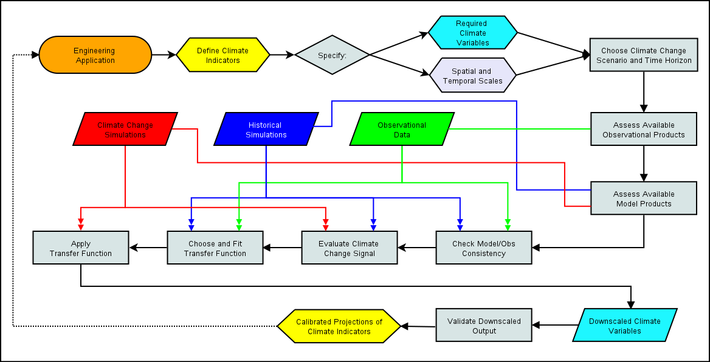

# Chapter 5: Downscaling Workflow

In the previous chapters, you've been introduced to the requisite background climate science and technical knowledge necessary for starting to work on a climate downscaling project. In this chapter, we'll put all of this knowledge together, and explicitly lay out the various decisions one needs to make when planning a climate change impact analysis study. In other words, this chapter will be about the "W" in UTCDW - here we will develop a generic **workflow** for downscaling.

||
|:--:|
|*Generic Downscaling Workflow*|

This flowchart includes each of the decisions and analysis steps required to produce calibrated projectections of a climate indicator/index relevant for your domain application (engineering related or otherwise). The content of this chapter will go through each decision in detail, explain the factors you'll need to consider, and provide guidance on best practices. Nearly all of the content will connect with information from previous chapters, so if something seems new and unfamiliar, return to the earlier part of this book and you'll likely find what you need to continue with confident understanding.

The first part of the workflow, up to and including "Assess Available Model Data", is about the preliminary study design process. After defining your research topic (e.g. "Engineering Application", though it doesn't necessarily need to be related to engineering), you'll need to define one or more metrics called **climate indicators** (Section 5.1), which relate your domain application to the weather or climate, and are calculated using particular climate variables with particular spatial and temportal samplings. For example, you might want daily maximum temperature data on a 10 km grid. Given these data requirements, you'll need to choose the available observational data product you will use both to establish the baseline values for which you're measuring changes from, and to use as training data for your downscaling. To look at future climate, you'll need to choose the type of climate change scenario you're interested in and how far into the future you'd like to assess changes, and given this information, choose the set of climate model simulations to use for investigating future projections. Only after making these decisions are you ready to tackle your research question and do statistical downscaling.

The second part of the workflow, from "Check Model/Obs Consistency" onwards, is about the data processing and analysis that will produce calibrated climate chnage projections of your climate indicator. You'll need to identify and characterize the model biases you aim to correct through downscaling, and look at the climate change signal in the unadjusted model data, all to inform your choice of downscaling method to apply. Next, you will apply your downscaling method to the output from the climate change simulations to produce downscaled climate variables used as inputs for calculating your climate indicator(s). These downscaled projections of your climate indicator can be used to study your domain application under future climate, and thus feed back into your engineering application - this is why the end of the flowchart points back to the beginning. Another reason why the flowchart loops back to the start is that science is by nature iterative. Very often the results of an analysis don't line up with your initial expectations, and you'll need tweak some aspect of your study design - be it the research question, your climate indicator(s), the datasets used, the chosen future period, or the downscaling method. Of course you will eventually terminate this loop once you're satisfied, and then proceed to interpret your results using your domain expertise and the context of your problem.

**Reinventing the Wheel**

The flowchart for the complete workflow assumes you are interested in produced your own statistically downscaled climate data, for use in your climate impact study. As you work through the first several steps, you may find that this isn't necessary, if downscaled projections of the variables needed to calculate your climate indicators (Section 5.1) are already available. In Sections 4.4 and 4.5 we worked with downscaled climate data from the Pacific Climate Impacts Consortium ([PCIC](https://pacificclimate.org/data/statistically-downscaled-climate-scenarios)), which provides selected downscaled output from CMIP5 and CMIP6 models, with spatial coverage over Canada. Similar pre-produced downscaled climate data is available from other organizations such as [CarbonPlan](https://carbonplan.org/research/cmip6-downscaling-explainer), [NASA-NEX](https://www.nasa.gov/nex/gddp), and the [Climate Impact Lab](https://planetarycomputer.microsoft.com/dataset/group/cil-gdpcir). If any of these downscaled datasets (or others) suit your needs, it would be sensible to take advantage of them instead of going through the trouble of doing downscaling yourself. 

If you plan to use an existing downscaled data product, you should still continue reading the rest of this guidebook. As you can see in the workflow schematic, there is much more to a climate impact study than producing downscaled climate data, and many study design decisions need to be made regardless of whether you plan to do your own downscaling or not. The only steps you'll skip are "Choose and Fit Transfer Function" and "Apply Transfer Function". The significance of these steps are not to be diminished, they are indeed a critical part of the downscaling workflow, which is why using an existing downscaled data product that suits your needs can save you significant amount of time and effort. If no publicly available downscaled data meets the requirements of your study, then have no fear, for that's the primary purpose of this guidebook! The information in this chapter will help you carry out the downscaling process.