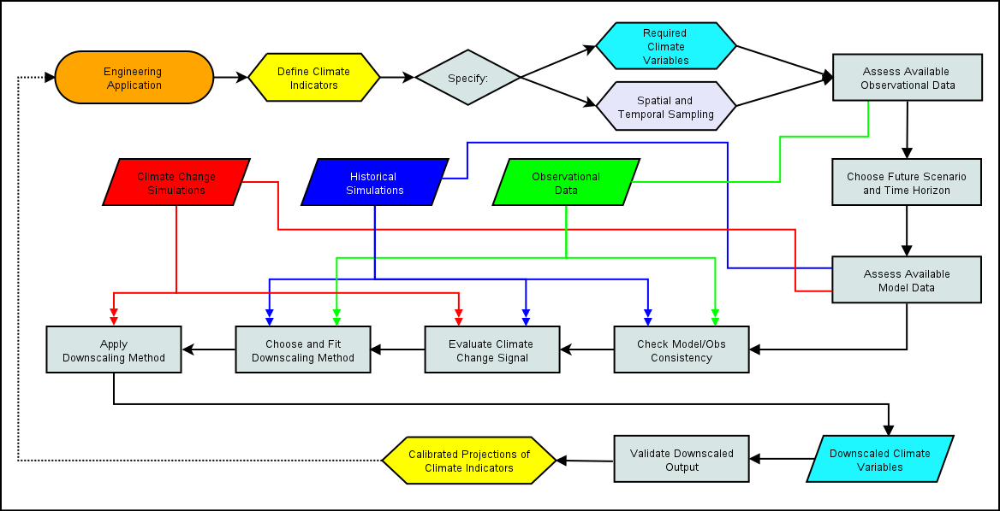

# Chapter 5: Downscaling Workflow

In the previous chapters, you've been introduced to the requisite background climate science and technical knowledge necessary for starting to work on a climate downscaling project. In this chapter, we'll put all of this knowledge together, and explicitly lay out the various decisions one needs to make when planning a climate change impact analysis study. In other words, this chapter will be about the "W" in UTCDW - here we will develop a generic **workflow** for downscaling.

||
|:--:|
|*Generic Downscaling Workflow*|

This flowchart includes each of the decisions and analysis steps required to produce calibrated projectections of a climate indicator/index relevant for your domain application (engineering related or otherwise). Each section of this chapter will go through a different decision in detail, explain the factors you'll need to consider, and provide guidance on best practices. Nearly all of the content will connect with information from previous chapters, so if something seems new and unfamiliar, return to the earlier part of this book and you'll likely find what you need to continue with confident understanding.