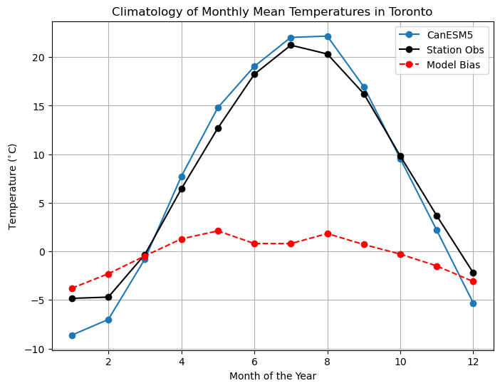

# 5.3 Exploratory Data Analysis

Once you have selected the observational and model datasets to use for your analysis, you can begin doing some exploratory data analysis, which will inform how you choose to downscale the model data.

## 5.3.1 Check Model/Obs Consistency

As demonstrated in Section 3.4, climate models are not perfect representation of the real physical climate system. Model output contains systematic errors that we call *biases* that downscaling and bias adjustment models aim to account for. In section 3.4 and, to some extent, section 4.4, we demonstrated how to quantify model biases. In partcular, 3.4 compared the probability density functions of Toronto monthly mean temperatures between one member of the CanESM5 historical ensemble, and observations from a weather station. Comparing the PDFs of a quantity at a particular location is useful for getting a sense of the severity and character of the model biases. This will be important for choosing an appropriate downscaling method (section 5.4). 

Good agreement between the raw model output and observations is encouraging. Only minor adjustment is required by the downscaling, and it is likely that there are observed analogues that share similar qualities to the model days being downscaled (if an analogue method is to be used, to produce higher resolution gridded downcaled output). If things look entirely wrong, then things become more complicated. Analogue-based downscaling methods are likely not appropriate, because even the lowest 30 RMSE days might not be good matches to the model. *note for mike: this content probably fits better in 5.4, figure out how to include it there.*

||
|:--:|
|*PDFs of Toronto Monthly Mean Temperature, from Section 3.4*|

We also compared the monthly climatologies of monthly mean temperature in Toronto, as well as the month-by-month mean bias of the model. The overall mean bias is small, but the mean bias for individual months of the year are all much larger. Since the mean bias is typically positive in the summer months and negative in the winter months, the effct averages out over the whole year, but the biases at smaller time scales will have important effects on your analysis. Understanding the seasonality of biases is also important when selecting your bias correction and/or downscaling methods.

||
|:--:|
|*Monthly Climatologies of Toronto Monthly Mean Temperature, from Section 3.4*|

Characterization of model biases goes beyond comparing PDFs and climatological means. Depending on your application, you may also wish to quantify biases in extreme values of your variables/quantities of interest, and also possibly temporal and spatial autocorrelations, as demonstrated in Section 4.4. The same methods used therein, for validating downscaled model output, can be applied for validating raw model ouput. 
